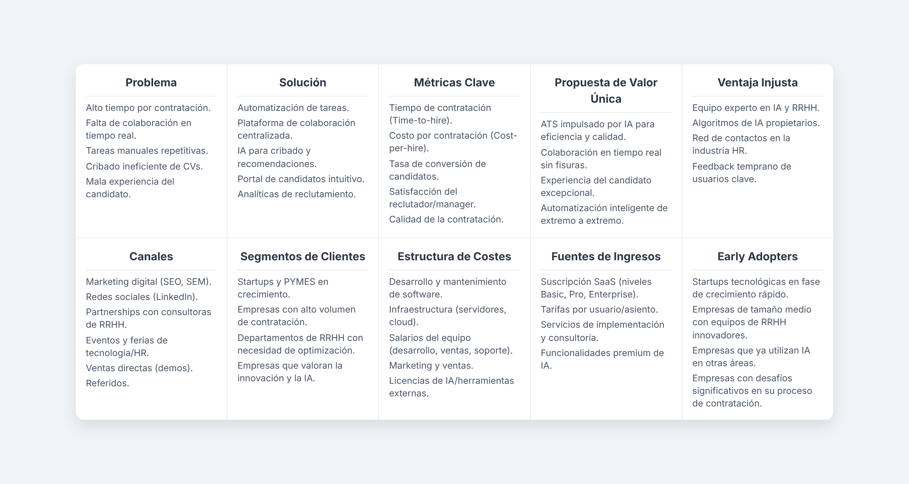
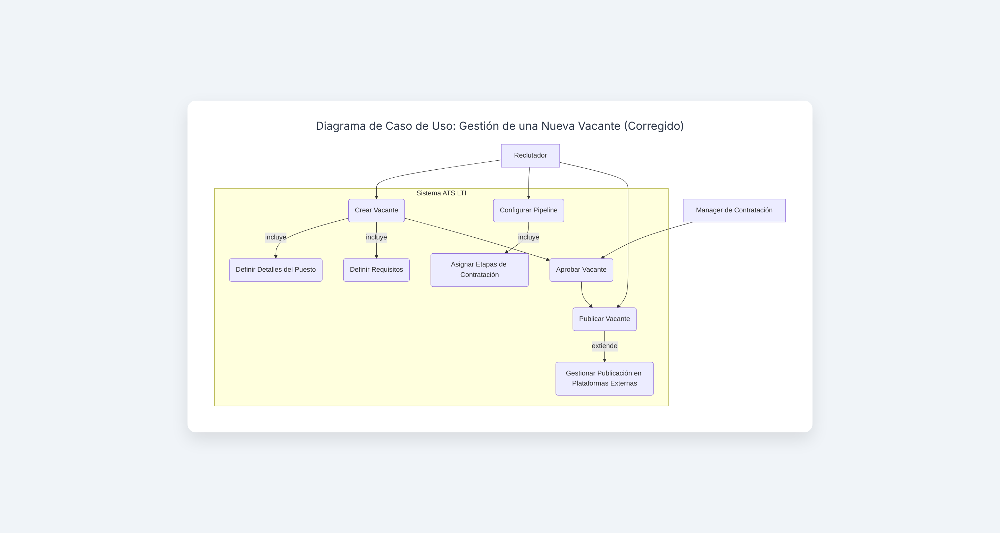
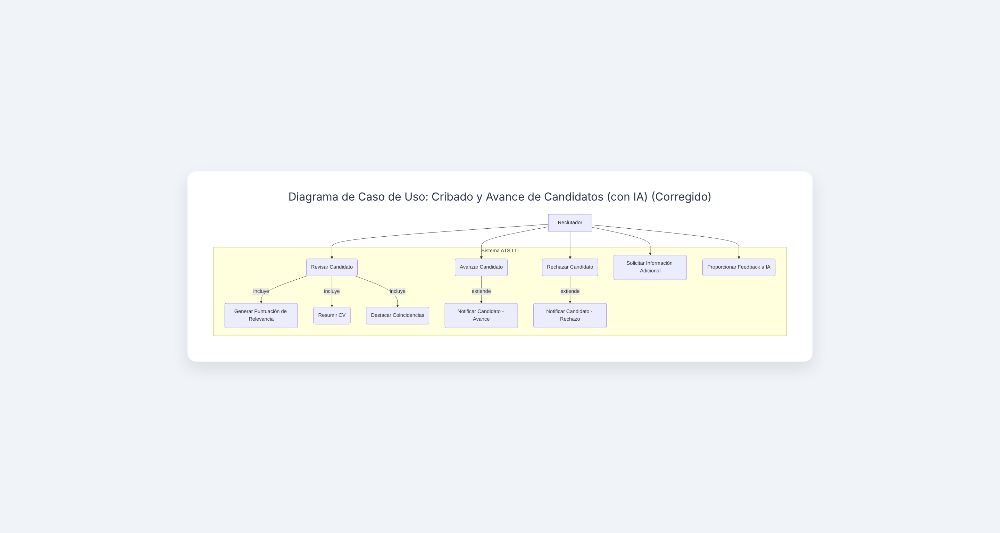
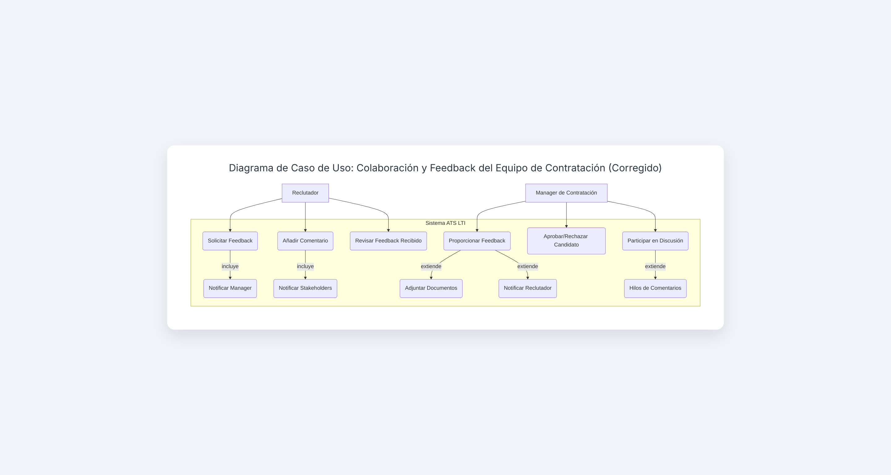
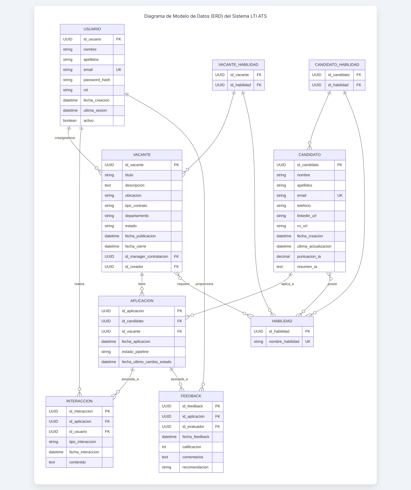
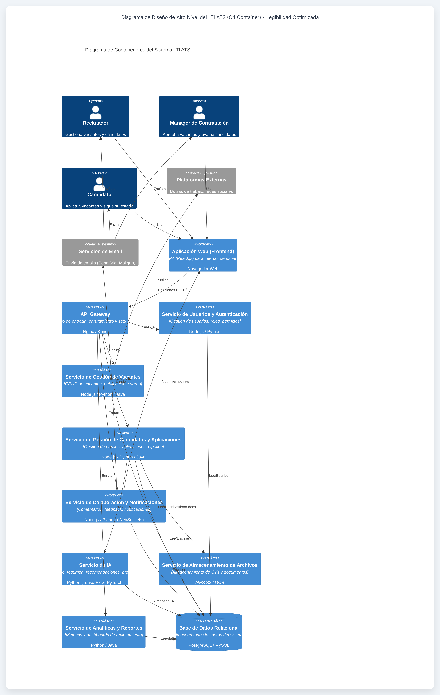

# LTI ATS: El Sistema de Gestión de Candidatos del Futuro

## Descripción Breve del Software LTI ATS

**LTI ATS** es una plataforma innovadora de gestión de candidatos diseñada para transformar y optimizar el proceso de reclutamiento y selección de personal. Va más allá de un sistema tradicional, integrando tecnologías avanzadas como la **inteligencia artificial** y la **automatización** para ofrecer una solución integral que mejora la eficiencia, la colaboración y la experiencia tanto para los equipos de Recursos Humanos como para los candidatos.  
Nuestro objetivo es reducir drásticamente los tiempos de contratación, mejorar la calidad de las contrataciones y liberar a los reclutadores de tareas repetitivas para que puedan centrarse en el talento.

---

## Valor Añadido y Ventajas Competitivas

**LTI ATS** se distingue por su enfoque en la eficiencia y la inteligencia. Sus principales ventajas competitivas incluyen:

### ✅ Colaboración en Tiempo Real Mejorada
Permite a reclutadores, managers de contratación y otros *stakeholders* colaborar de manera fluida y en tiempo real, compartiendo feedback, notas y decisiones sobre los candidatos en una interfaz unificada. Esto elimina silos y acelera el proceso de toma de decisiones.

### ✅ Automatización Inteligente
Automatiza tareas repetitivas y de bajo valor, como el cribado inicial de currículums, la programación de entrevistas y el envío de comunicaciones a candidatos. Esto libera tiempo valioso para el equipo de RRHH.

### ✅ Asistencia de IA Avanzada
La IA es el corazón de **LTI ATS**, ofreciendo funcionalidades como:

- **Cribado de CVs basado en IA:** Identifica automáticamente a los candidatos más adecuados basándose en las descripciones de los puestos y los perfiles de los candidatos.
- **Recomendaciones de Candidatos:** Sugiere proactivamente candidatos de la base de datos o de fuentes externas que coincidan con los requisitos del puesto.
- **Generación de Preguntas para Entrevistas:** Asiste en la creación de preguntas relevantes y personalizadas para las entrevistas.
- **Análisis de Sentimiento (opcional):** Puede analizar el tono de las comunicaciones con los candidatos para asegurar una experiencia positiva.

### ✅ Experiencia del Candidato Superior
A través de comunicaciones automatizadas y personalizadas, un portal de candidatos intuitivo y un seguimiento transparente del estado de su aplicación, **LTI ATS** busca ofrecer una experiencia de candidato excepcional, mejorando la marca empleadora.

### ✅ Análisis y Reportes Detallados
Proporciona *dashboards* y métricas en tiempo real sobre el *pipeline* de contratación, la eficiencia del proceso, el origen de los candidatos y otros KPIs clave, permitiendo una toma de decisiones basada en datos.

---

## Funciones Principales

- **Gestión de Vacantes:** Creación, edición y publicación de ofertas de empleo en múltiples plataformas (bolsas de trabajo, redes sociales, sitio web de la empresa).
- **Gestión de Candidatos:** Recepción, almacenamiento y organización de currículums y perfiles de candidatos. Cribado inteligente y etiquetado.
- **Pipeline de Reclutamiento Personalizable:** Configuración y seguimiento de las diferentes etapas del proceso de selección (ej. Solicitado, Cribado, Entrevista, Oferta, Contratado).
- **Colaboración y Feedback:** Herramientas para que los reclutadores y managers de contratación puedan dejar comentarios, calificar candidatos y tomar decisiones conjuntas.
- **Comunicación con Candidatos:** Plantillas de correo electrónico personalizables, envío automatizado de notificaciones y un portal de candidatos para que estos puedan consultar el estado de su aplicación.
- **Programación de Entrevistas:** Herramienta integrada para coordinar y programar entrevistas con múltiples participantes, incluyendo recordatorios automáticos.
- **Base de Datos de Talentos (Talent Pool):** Creación y gestión de una base de datos de candidatos pasivos o futuros, con capacidad de búsqueda avanzada.
- **Reportes y Analíticas:** *Dashboards* personalizables con métricas clave sobre el rendimiento del reclutamiento, como tiempo de contratación, costo por contratación, fuentes de candidatos, etc.
- **Integraciones:** Capacidad para integrarse con otras herramientas de RRHH (HRIS, sistemas de nóminas, herramientas de evaluación).
- **Módulo de IA:** Funcionalidades específicas impulsadas por IA para cribado, recomendaciones y asistencia en la redacción.

# Caso de Uso 1: Gestión de una Nueva Vacante

## Nombre del Caso de Uso
**Gestión de una Nueva Vacante**

---

## Descripción

Este caso de uso describe el proceso mediante el cual un **Reclutador** o un **Manager de Contratación** crea, configura y publica una nueva oferta de empleo dentro del sistema **LTI ATS**. Incluye la definición de los detalles del puesto, los requisitos, el *pipeline* de contratación y la integración con plataformas de publicación externas.

---

## Actores Principales

- **Reclutador:** Usuario principal que gestiona las vacantes.
- **Manager de Contratación:** Puede iniciar o aprobar la creación de vacantes.
- **Sistema ATS LTI:** El software que gestiona la lógica y los datos.

---

## Precondiciones

- El usuario (Reclutador o Manager de Contratación) ha iniciado sesión en el Sistema ATS LTI.
- El usuario tiene los permisos necesarios para crear nuevas vacantes.

---

## Flujo de Eventos (*Escenario Principal*)

1. El Reclutador selecciona la opción **"Crear Nueva Vacante"** en el *dashboard* del ATS.
2. El Sistema ATS presenta un formulario para la creación de la vacante.
3. El Reclutador ingresa la información básica de la vacante:
   - Título del Puesto
   - Descripción del Puesto
   - Ubicación
   - Tipo de Contrato (ej. tiempo completo, parcial)
   - Departamento
   - Manager de Contratación asociado
4. El Reclutador define los requisitos del puesto (habilidades, experiencia, educación).
5. El Reclutador configura el *pipeline* de contratación para esta vacante (ej. Solicitado → Cribado → Entrevista Inicial → Entrevista Técnica → Oferta → Contratado).
6. El Reclutador adjunta cualquier documento relevante (ej. JD detallado).
7. El Reclutador revisa la información de la vacante.
8. El Reclutador guarda la vacante como borrador o la envía para aprobación (si aplica).
9. Si se requiere aprobación, el Manager de Contratación recibe una notificación.
10. El Manager de Contratación revisa la vacante y la aprueba.
11. Una vez aprobada (o si no requiere aprobación), el Reclutador selecciona las plataformas donde desea publicar la vacante (ej. sitio web de la empresa, LinkedIn, bolsas de trabajo).
12. El Sistema ATS publica automáticamente la vacante en las plataformas seleccionadas.
13. El Sistema ATS confirma la publicación exitosa de la vacante.

---

## Flujos Alternativos

### A1: Vacante Rechazada por Manager de Contratación (Paso 10)

- **10a.** El Manager de Contratación rechaza la vacante y proporciona comentarios.
- **10b.** El Reclutador recibe una notificación del rechazo con los comentarios.
- **10c.** El Reclutador edita la vacante basándose en los comentarios y la vuelve a enviar para aprobación (*regresa al paso 8*).

### A2: Error al Publicar Vacante (Paso 12)

- **12a.** El Sistema ATS detecta un error al intentar publicar en una o varias plataformas.
- **12b.** El Sistema ATS notifica al Reclutador sobre el error y las plataformas afectadas.
- **12c.** El Reclutador puede intentar republicar manualmente o contactar soporte.

---

## Postcondiciones

- La nueva vacante ha sido creada y está disponible en el Sistema ATS.
- Si fue publicada, la vacante es visible en las plataformas externas seleccionadas.
- Los candidatos pueden comenzar a aplicar a la vacante.

# Caso de Uso 2: Cribado y Avance de Candidatos (con IA)

## Nombre del Caso de Uso
**Cribado y Avance de Candidatos (con IA)**

---

## Descripción

Este caso de uso detalla cómo el **Sistema ATS LTI**, con la asistencia de **Inteligencia Artificial**, ayuda a los **Reclutadores** a cribar y gestionar el avance de los candidatos a través de las diferentes etapas del *pipeline* de contratación para una vacante específica.

---

## Actores Principales

- **Reclutador:** Usuario principal que revisa y avanza a los candidatos.
- **Sistema ATS LTI:** El software que gestiona la lógica, los datos y las funcionalidades de IA.
- **Módulo de IA:** Componente interno del sistema que realiza el cribado y las recomendaciones.

---

## Precondiciones

- Una vacante ha sido creada y publicada.
- Existen candidatos que han aplicado a la vacante.
- El Reclutador ha iniciado sesión en el Sistema ATS LTI.

---

## Flujo de Eventos (*Escenario Principal*)

1. El Reclutador accede a la lista de candidatos para una vacante específica.
2. El Sistema ATS LTI muestra los candidatos, ordenados por la puntuación de relevancia generada por el **Módulo de IA**.
3. El Reclutador revisa el perfil y el currículum de un candidato.
4. El Módulo de IA proporciona un resumen del CV y destaca las coincidencias clave con los requisitos del puesto.
5. El Reclutador decide si el candidato cumple con los requisitos iniciales.
6. Si el candidato es adecuado, el Reclutador lo avanza a la siguiente etapa del *pipeline* (ej. **"Cribado Telefónico"**).
7. El Sistema ATS LTI actualiza el estado del candidato y registra la acción.
8. El Sistema ATS LTI puede enviar una notificación automatizada al candidato sobre el cambio de estado (si configurado).
9. El Reclutador repite el proceso para otros candidatos.

---

## Flujos Alternativos

### A1: Candidato No Adecuado (Paso 5)

- **5a.** Si el Reclutador decide que el candidato no es adecuado, lo marca como **"Rechazado"** o **"No apto"**.
- **5b.** El Sistema ATS LTI actualiza el estado del candidato.
- **5c.** El Sistema ATS LTI puede enviar una notificación de rechazo automatizada al candidato (si configurado).

### A2: Necesidad de Más Información (Paso 5)

- **5a.** El Reclutador necesita más información y envía una solicitud de datos adicionales al candidato a través del sistema.
- **5b.** El candidato recibe la solicitud y sube la información requerida a través del portal del candidato.
- **5c.** El Sistema ATS LTI notifica al Reclutador cuando la información ha sido recibida (*regresa al paso 3*).

### A3: Ajuste de Puntuación de IA (Paso 4)

- **4a.** El Reclutador considera que la puntuación de IA no es precisa y puede proporcionar *feedback* al Módulo de IA para mejorar futuros cribados.
- **4b.** El Sistema ATS LTI registra el *feedback* para el entrenamiento del modelo de IA.

---

## Postcondiciones

- El estado de los candidatos ha sido actualizado en el sistema.
- Los candidatos adecuados han avanzado a la siguiente etapa del *pipeline*.
- Los candidatos no adecuados han sido rechazados o marcados para seguimiento posterior.
- El Módulo de IA puede haber recibido *feedback* para su mejora.

# Caso de Uso 3: Colaboración y Feedback del Equipo de Contratación

## Nombre del Caso de Uso
**Colaboración y Feedback del Equipo de Contratación**

---

## Descripción

Este caso de uso describe cómo los miembros del equipo de contratación (**Reclutadores** y **Managers de Contratación**) colaboran en tiempo real dentro del **ATS LTI** para evaluar candidatos, compartir feedback y tomar decisiones conjuntas sobre el avance o rechazo de los mismos.

---

## Actores Principales

- **Reclutador:** Inicia discusiones, solicita feedback, comparte perfiles.
- **Manager de Contratación:** Proporciona feedback, aprueba o rechaza candidatos.
- **Sistema ATS LTI:** La plataforma que facilita la comunicación y el registro del feedback.

---

## Precondiciones

- Existen candidatos en el *pipeline* de una vacante.
- Los Reclutadores y Managers de Contratación relevantes han sido asignados a la vacante.
- Los usuarios han iniciado sesión en el Sistema ATS LTI.

---

## Flujo de Eventos (*Escenario Principal*)

1. El Reclutador accede al perfil de un candidato específico que requiere feedback del Manager de Contratación.
2. El Reclutador utiliza la funcionalidad de **"Solicitar Feedback"** o **"Añadir Comentario"** en el perfil del candidato.
3. El Reclutador escribe un comentario, hace una pregunta o solicita una evaluación específica al Manager de Contratación.
4. El Sistema ATS LTI notifica al Manager de Contratación sobre la solicitud de feedback o el nuevo comentario.
5. El Manager de Contratación accede al perfil del candidato.
6. El Manager de Contratación revisa el perfil, los documentos adjuntos (CV, notas de entrevista) y los comentarios existentes.
7. El Manager de Contratación añade su propio comentario, calificación o decisión (ej. **"Aprobar para siguiente fase"**, **"Rechazar"**).
8. El Sistema ATS LTI registra el feedback y lo asocia al candidato y a la vacante.
9. El Sistema ATS LTI notifica al Reclutador sobre el feedback o la decisión del Manager de Contratación.
10. El Reclutador revisa el feedback y procede con la acción correspondiente (ej. programar entrevista, enviar oferta).

---

## Flujos Alternativos

### A1: Discusión en Hilo (Paso 7)

- **7a.** En lugar de una decisión final, el Manager de Contratación puede iniciar una discusión en un hilo de comentarios con el Reclutador u otros *stakeholders* para aclarar dudas o debatir.
- **7b.** El Sistema ATS LTI permite respuestas anidadas y notificaciones a todos los participantes del hilo.
- **7c.** La discusión continúa hasta que se llega a una decisión (*regresa al paso 7*).

### A2: Adjuntar Documentos a Feedback (Paso 7)

- **7a.** El Manager de Contratación puede adjuntar documentos (ej. notas de entrevista, evaluaciones) a su feedback.
- **7b.** El Sistema ATS LTI almacena los documentos y los asocia al feedback y al candidato.

### A3: Notificaciones Personalizables (Paso 4, 9)

- **4a/9a.** Los usuarios pueden configurar sus preferencias de notificación (ej. email, notificación *in-app*, resumen diario) para el feedback y las solicitudes.

---

## Postcondiciones

- El feedback y las decisiones del equipo de contratación están registrados y son visibles en el perfil del candidato.
- El Reclutador puede avanzar en el proceso de contratación basándose en el feedback recibido.
- La colaboración entre los miembros del equipo ha sido facilitada y documentada.

# Modelo de Datos del Sistema LTI ATS

Este modelo de datos describe las entidades clave, sus atributos y las relaciones que sustentan las funcionalidades del ATS de LTI. Está diseñado para ser **escalable** y soportar la gestión de vacantes, candidatos, interacciones y la colaboración del equipo.

---

## 📌 Entidades Principales

### 🧑 Usuario

**Descripción:** Representa a los usuarios del sistema (*Reclutadores*, *Managers de Contratación*, *Administradores*).

**Atributos:**
- `id_usuario`: UUID *(Clave Primaria)*
- `nombre`: Cadena de texto
- `apellidos`: Cadena de texto
- `email`: Cadena de texto *(Único)*
- `password_hash`: Cadena de texto
- `rol`: Cadena de texto *(ej. 'Reclutador', 'Manager', 'Admin')*
- `fecha_creacion`: Fecha/Hora
- `ultima_sesion`: Fecha/Hora *(Opcional)*
- `activo`: Booleano

---

### 📄 Vacante

**Descripción:** Representa una oferta de empleo publicada por la empresa.

**Atributos:**
- `id_vacante`: UUID *(Clave Primaria)*
- `titulo`: Cadena de texto
- `descripcion`: Texto largo
- `ubicacion`: Cadena de texto
- `tipo_contrato`: Cadena de texto *(ej. 'Tiempo Completo', 'Parcial', 'Freelance')*
- `departamento`: Cadena de texto
- `estado`: Cadena de texto *(ej. 'Borrador', 'Abierta', 'Cerrada', 'Archivada')*
- `fecha_publicacion`: Fecha/Hora *(Opcional)*
- `fecha_cierre`: Fecha/Hora *(Opcional)*
- `id_manager_contratacion`: UUID *(Clave Foránea a Usuario)*
- `id_creador`: UUID *(Clave Foránea a Usuario)*

---

### 👤 Candidato

**Descripción:** Representa a una persona que ha aplicado a una vacante o está en la base de datos de talentos.

**Atributos:**
- `id_candidato`: UUID *(Clave Primaria)*
- `nombre`: Cadena de texto
- `apellidos`: Cadena de texto
- `email`: Cadena de texto *(Único)*
- `telefono`: Cadena de texto *(Opcional)*
- `linkedin_url`: Cadena de texto *(Opcional)*
- `cv_url`: Cadena de texto *(URL al archivo del CV)*
- `fecha_creacion`: Fecha/Hora
- `ultima_actualizacion`: Fecha/Hora
- `puntuacion_ia`: Número decimal *(Opcional, generada por IA)*
- `resumen_ia`: Texto largo *(Opcional, generado por IA)*

---

### 📌 Aplicacion

**Descripción:** Representa la postulación de un candidato a una vacante específica.

**Atributos:**
- `id_aplicacion`: UUID *(Clave Primaria)*
- `id_candidato`: UUID *(Clave Foránea a Candidato)*
- `id_vacante`: UUID *(Clave Foránea a Vacante)*
- `fecha_aplicacion`: Fecha/Hora
- `estado_pipeline`: Cadena de texto *(ej. 'Solicitado', 'Cribado', 'Entrevista', 'Oferta', 'Contratado', 'Rechazado')*
- `fecha_ultimo_cambio_estado`: Fecha/Hora

---

### 📞 Interaccion

**Descripción:** Registra cualquier tipo de interacción con un candidato (ej. llamada, email, entrevista).

**Atributos:**
- `id_interaccion`: UUID *(Clave Primaria)*
- `id_aplicacion`: UUID *(Clave Foránea a Aplicacion)*
- `id_usuario`: UUID *(Clave Foránea a Usuario, quien realizó la interacción)*
- `tipo_interaccion`: Cadena de texto *(ej. 'Llamada', 'Email', 'Entrevista', 'Nota')*
- `fecha_interaccion`: Fecha/Hora
- `contenido`: Texto largo *(Notas de la interacción, transcripción, etc.)*

---

### 🗣️ Feedback

**Descripción:** Registra el feedback de los miembros del equipo sobre un candidato en el contexto de una aplicación.

**Atributos:**
- `id_feedback`: UUID *(Clave Primaria)*
- `id_aplicacion`: UUID *(Clave Foránea a Aplicacion)*
- `id_evaluador`: UUID *(Clave Foránea a Usuario)*
- `fecha_feedback`: Fecha/Hora
- `calificacion`: Número entero *(ej. 1-5, opcional)*
- `comentarios`: Texto largo
- `recomendacion`: Cadena de texto *(ej. 'Avanzar', 'Rechazar', 'Considerar')*

---

### 🛠️ Habilidad

**Descripción:** Representa una habilidad específica que puede ser requerida por una vacante o poseída por un candidato.

**Atributos:**
- `id_habilidad`: UUID *(Clave Primaria)*
- `nombre_habilidad`: Cadena de texto *(Único)*

---

## 🔗 Relaciones

- **Usuario (1) -- (N) Vacante:**  
  Un usuario puede crear y ser el manager de contratación de muchas vacantes.  
  - `Vacante.id_manager_contratacion` referencia `Usuario.id_usuario`  
  - `Vacante.id_creador` referencia `Usuario.id_usuario`

- **Candidato (1) -- (N) Aplicacion:**  
  Un candidato puede tener múltiples aplicaciones.  
  - `Aplicacion.id_candidato` referencia `Candidato.id_candidato`

- **Vacante (1) -- (N) Aplicacion:**  
  Una vacante puede recibir múltiples aplicaciones.  
  - `Aplicacion.id_vacante` referencia `Vacante.id_vacante`

- **Aplicacion (1) -- (N) Interaccion:**  
  Una aplicación puede tener múltiples interacciones asociadas.  
  - `Interaccion.id_aplicacion` referencia `Aplicacion.id_aplicacion`

- **Usuario (1) -- (N) Interaccion:**  
  Un usuario realiza muchas interacciones.  
  - `Interaccion.id_usuario` referencia `Usuario.id_usuario`

- **Aplicacion (1) -- (N) Feedback:**  
  Una aplicación puede recibir múltiples feedbacks.  
  - `Feedback.id_aplicacion` referencia `Aplicacion.id_aplicacion`

- **Usuario (1) -- (N) Feedback:**  
  Un usuario proporciona muchos feedbacks.  
  - `Feedback.id_evaluador` referencia `Usuario.id_usuario`

- **Vacante (N) -- (M) Habilidad:**  
  Una vacante requiere muchas habilidades y una habilidad puede ser requerida por muchas vacantes (*Tabla de unión: VacanteHabilidad*).  
  - `VacanteHabilidad.id_vacante` referencia `Vacante.id_vacante`  
  - `VacanteHabilidad.id_habilidad` referencia `Habilidad.id_habilidad`

- **Candidato (N) -- (M) Habilidad:**  
  Un candidato posee muchas habilidades y una habilidad puede ser poseída por muchos candidatos (*Tabla de unión: CandidatoHabilidad*).  
  - `CandidatoHabilidad.id_candidato` referencia `Candidato.id_candidato`  
  - `CandidatoHabilidad.id_habilidad` referencia `Habilidad.id_habilidad`

---

## 🗂️ Tablas de Unión *(para relaciones N:M)*

### 📌 VacanteHabilidad
- `id_vacante`: UUID *(Clave Foránea a Vacante)*
- `id_habilidad`: UUID *(Clave Foránea a Habilidad)*

### 📌 CandidatoHabilidad
- `id_candidato`: UUID *(Clave Foránea a Candidato)*
- `id_habilidad`: UUID *(Clave Foránea a Habilidad)*

# Diseño del Sistema a Alto Nivel del LTI ATS

El sistema **LTI ATS** se diseñará con una **arquitectura de microservicios**, lo que permitirá una mayor **escalabilidad**, **flexibilidad** y **resiliencia**. Cada componente principal será un servicio independiente que se comunicará a través de **APIs bien definidas**.

---

## ⚙️ Componentes Principales

### 🎨 Capa de Presentación (*Frontend*)

**Descripción:**  
Interfaz de usuario con la que interactúan Reclutadores, Managers de Contratación y Candidatos. Será una aplicación web **responsiva**, accesible desde cualquier dispositivo.

**Tecnologías Clave:**  
React.js (o similar), HTML, CSS (Tailwind CSS), JavaScript.

**Funcionalidades:**  
- Dashboards  
- Formularios de creación/edición  
- Listas de candidatos/vacantes  
- Portal de candidatos  
- Herramientas de colaboración

---

### 🔗 API Gateway

**Descripción:**  
Punto de entrada único para todas las solicitudes del frontend y de sistemas externos. Actúa como un **proxy inverso**, enrutando las peticiones a los microservicios adecuados, gestionando la **autenticación**, **autorización** y limitación de tasas.

**Tecnologías Clave:**  
Nginx, Kong, AWS API Gateway, Azure API Management.

---

### 👥 Servicio de Gestión de Usuarios y Autenticación (*Auth Service*)

**Descripción:**  
Encargado de la gestión de usuarios (*registro, login, roles, permisos*) y la **autenticación/autorización** de todas las peticiones que llegan al sistema.

**Tecnologías Clave:**  
Node.js/Python (Express/Django REST), OAuth 2.0, JWT, Base de Datos de Usuarios.

---

### 📄 Servicio de Gestión de Vacantes (*Job Posting Service*)

**Descripción:**  
Maneja toda la lógica relacionada con la creación, edición, publicación y gestión del ciclo de vida de las vacantes. Incluye integración con plataformas externas.

**Tecnologías Clave:**  
Node.js/Python/Java, Base de Datos de Vacantes.

---

### 👤 Servicio de Gestión de Candidatos y Aplicaciones (*Candidate & Application Service*)

**Descripción:**  
Gestiona los perfiles de los candidatos, sus aplicaciones a las vacantes y el seguimiento a través del *pipeline*. Es el corazón del flujo de trabajo de reclutamiento.

**Tecnologías Clave:**  
Node.js/Python/Java, Base de Datos de Candidatos/Aplicaciones.

---

### 💬 Servicio de Colaboración y Notificaciones (*Collaboration & Notification Service*)

**Descripción:**  
Facilita la comunicación entre los miembros del equipo (comentarios, feedback) y gestiona el envío de **notificaciones** (emails, *in-app*) a usuarios y candidatos.

**Tecnologías Clave:**  
Node.js/Python, WebSockets (colaboración en tiempo real), servicios de email (SendGrid, Mailgun).

---

### 🤖 Servicio de IA (*AI Service*)

**Descripción:**  
Contiene los modelos de IA para el **cribado de CVs**, resumen de perfiles, recomendaciones de candidatos y generación de preguntas para entrevistas. Se comunica con el Servicio de Gestión de Candidatos.

**Tecnologías Clave:**  
Python (TensorFlow, PyTorch, scikit-learn), FastAPI/Flask.

---

### 📂 Servicio de Almacenamiento de Archivos (*File Storage Service*)

**Descripción:**  
Almacena de forma segura los currículums, cartas de presentación y otros documentos adjuntos por candidatos o usuarios.

**Tecnologías Clave:**  
AWS S3, Google Cloud Storage, Azure Blob Storage.

---

### 🗄️ Capa de Datos (*Database Layer*)

**Descripción:**  
Base de datos persistente para almacenar toda la información del sistema. Por la naturaleza relacional de los datos, se utilizará principalmente una base de datos **relacional**.

**Tecnologías Clave:**  
PostgreSQL, MySQL o bases de datos gestionadas (AWS RDS, Google Cloud SQL).

---

### 📊 Servicio de Analíticas y Reportes (*Analytics & Reporting Service*)

**Descripción:**  
Recopila datos de los otros servicios para generar **métricas**, **dashboards** y reportes personalizados sobre el rendimiento del reclutamiento.

**Tecnologías Clave:**  
Python/Java, herramientas de BI (Tableau, Power BI) o librerías de visualización.

---

## 🔗 Interacciones Clave

- El **Frontend** se comunica con el **API Gateway**.
- El **API Gateway** enruta peticiones a los Servicios de Backend (*Usuarios, Vacantes, Candidatos, Colaboración, IA, etc.*).
- Los Servicios de Backend interactúan con la **Capa de Datos** para operaciones CRUD.
- El **Servicio de Gestión de Candidatos y Aplicaciones** invoca al **Servicio de IA** para procesamiento de CVs y puntuaciones.
- El **Servicio de Colaboración y Notificaciones** se comunica con otros servicios para alertas y actualizaciones en tiempo real.
- El **Servicio de Almacenamiento de Archivos** es utilizado para guardar o recuperar documentos.
- El **Servicio de Analíticas y Reportes** consume datos de los otros servicios para generar información valiosa.

---

## ✅ Beneficios de la Arquitectura Modular

Esta arquitectura **modular y desacoplada** permitirá a LTI:
- Escalar componentes de forma **independiente**
- Facilitar el desarrollo por **equipos separados**
- Adoptar nuevas tecnologías de forma **ágil**
- Mejorar la **resiliencia** y la **observabilidad** del sistema

